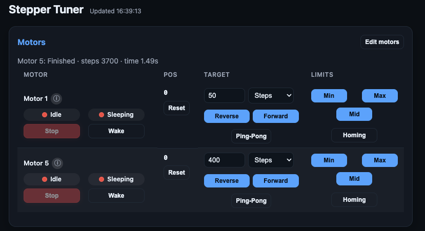
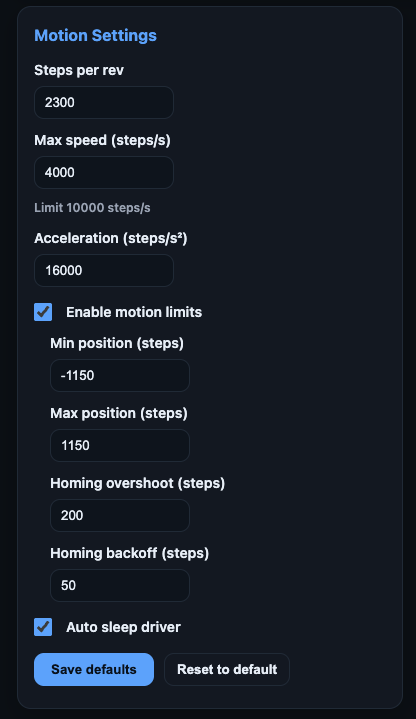

# Stepper Tuner

ESP32/PlatformIO firmware that hosts a web UI and JSON API to orchestrate one or more 4-wire stepper motors via FastAccelStepper.

## Features

- Multi-motor management: add/update/remove motors with STEP/DIR/SLEEP pins, persisted to NVS so configs survive reboots.
- Motion planning with selectable target units (revs/degrees/steps), max speed, acceleration, auto-sleep guardrails, and optional limit windows.
- Run modes per motor: single-shot moves, ping-pong loops, and limit-aware homing with configurable overshoot/backoff. Limit trips are reported with a sequence counter and motor id.
- Web UI (LittleFS) mirrors the API, streams live telemetry (position, speed, last run), and exposes the Wi-Fi provisioning portal.

## Build & Upload

- `pio run -e esp32dev` – build firmware.
- `pio run -e esp32dev -t buildfs` – regenerate the LittleFS image after editing `data_src/` (do not hand-edit `data/`).
- `pio run -e esp32dev -t upload` / `-t uploadfs` – flash firmware or the UI image when connected to hardware.
- Default AP credentials live in `include/README`; override via `include/secrets.h` (keep secrets out of version control).

## API Highlights

- `GET /api/state` – aggregated motion settings, limit status, and motor telemetry (mode, driver state, planned steps, last run).
- `POST /api/settings` – patch shared settings; accepts target value/units, speed/accel, auto-sleep, limit range, and homing overshoot/backoff.
- `POST /api/run` – start/stop a motor with `mode: single|pingpong|homing|stop`, `direction`, and `motorId`.
- `POST /api/driver`, `/api/stop`, `/api/reset` – wake/sleep drivers, abort motion, or re-zero motors (single/all).
- `POST /api/motors/add|update|remove` – manage persisted motors; responses echo `createdMotorId` when applicable.
- `POST /api/settings/default/save` / `restore` – persist or reload shared motion defaults.

## Heads up

This is mostly quick-and-dirty vibe coded. It works, but the code isn’t exactly polished or battle-tested.

## License

[MIT](LICENSE)
